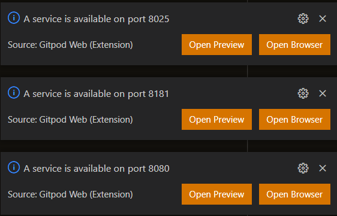
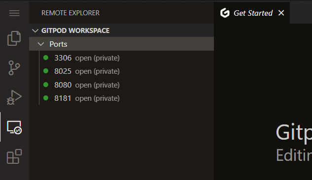

# SuiteCRM 8 Docker

This project is a fork of [https://github.com/jontitmus-code/SuiteCRM8_docker](https://github.com/jontitmus-code/SuiteCRM8_docker) with automated installation and configuration.

## [Click here to try it now on Gitpod.io](https://gitpod.io/#https://github.com/wilj/SuiteCRM8_docker)

The Gitpod workspace configuration will automatically build, install, and run SuiteCRM, MariaDB, phpMyAdmin, and MailHog.

As the services are launched, their ports will be exposed via HTTPS, and notifications will appear:

The ports can be accessed at any time from the port list:

phpMyAdmin may throw errors if browsed to before the database is fully populated.

## Logging In

The initial admin user name and password can be set by environment variable:

    DEFAULT_ADMIN_USER
    DEFAULT_ADMIN_PASSWORD

If the default user/password variables are blank or unset, they will default to "admin" and a randomly generated password will be printed to the log output with the text "Using generated admin password \<password\>"